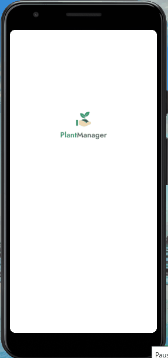

    

    <h1> PlantManager</h2>
    <h2> Lembre-se de molhar a sua plantinha ☺ </h2>
    

  

## 💻 O Projeto
O PlantManager é uma aplicação desenvolvida durante a Next Level Week 5 de React Native da RocketSeat. O Objetivo do aplicativo é simplimente lembrar a pessoa na hora de molhar a planta, qual é o melhor ambiente da casa que é melhor para ela e o mais importante é aprender com o projeto.

## 🔧 Tecnologias
- [TypeScript](https://www.typescriptlang.org/)
- [React Native](https://reactnative.dev/docs/)
- [Expo](https://docs.expo.io/)

## 👩‍💻 Meu Objetivo
  Achei interessante falar sobre o meus objetivos e o que me marcou no projeto por ainda ser iniciante em JS. 
  - Primeiro: Foi a curiosidade em fazer a semana da RocketSeat, pois, eu gostaria de saber como funcionava e foi a minha primeira trilha; 
  - Segundo: Minha meta é depois dominar JS, CSS e HTML e quando acontecer isso quero desenvolver em React Native, mas eu ainda não sabia como funcionava e então foi amor a primeira vista; e  
  - Terceiro: Gostei muito, porque, vi o que estou estudando agora e como faz uso lá na frente.  
   

<blockquote>
    Feito por Milena Ferreira Gomes 
</blockquote>

